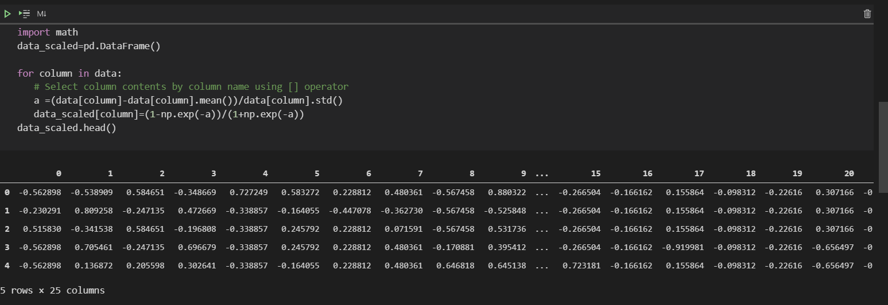

# Problem one

* **This function that return scores of ten trials**
* **Using Scikit learn to create model svc**

## Problem one Part one

* **Scores of ten trials for non-scaled data**

## Problem one Part two

**At the first I used Equation of**

**To do Normalization between -1 and 1**

**but because of statement specified one technique to do this normalization by subtract each attribute by mean then normalize between -1 and 1.I used**

**But I faced issue which is data is normalized but is not in range -1 and 1 . so i tried a lot of technique to do it and finally i found sigmoid function is very good**

**This is data after Normalization**

### **After Scaling i found that Model of SVM can't classify Labele and give error that label is continous so I used LabelEncoder Model that transform labels to 0 and 1.**

## Discussion
**Through Ten trials with Scaled and non-Scaled Data , Most of trials had higher score in scaled data than non scaled data. But because of data don't differ a lot  in range of attributes so difference in score was small**
> **Scaling Features with SVM is very important because it is avoiding attributes in greater numeric ranges dominating those in smaller numeric ranges.** 

> **In practical ,I found that in sometimes during runtime non-scaled data gave score higer than scaled data in avarge but a little. so i thought it is because data don't differ alot in range. really ,I was surprised**

