### **The last 50 instences in iris data is one type "Virginica" and also The first 50 instences is "setosa". so the rest data is just two classes**

* **The head 50 instences from data**

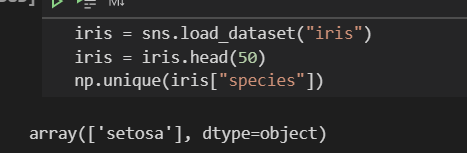

* **The tail 50 instences from data**

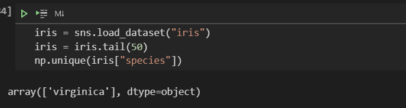

# Impelementation of Soft Margin SVM with Gradient Descent

## HyperPlane Equation

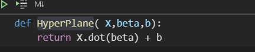

## Cost Function or Loss Function (We try to Minimize this Function . to increase margin that help us to choose the best hyberPlane)

* **Slack Variable : **

**Depend On**

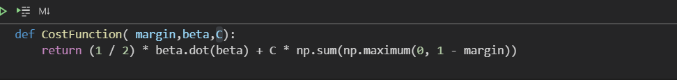

> **HyperParameter C can determine margin if c close to zero so we trying maximize margin and vice verse**

## Margin

**Where**

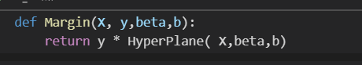  

## Gradient Descent 
**as we learnt in the second lecture, We can update weightes by derivative of cost function w.r.t weights and learning rate or **

**Derivative w.r.t Beta : **

**Update of beta :**

**Derivative w.r.t b : **

**Update of b :**

> For sure, We update weights based on missclassified points

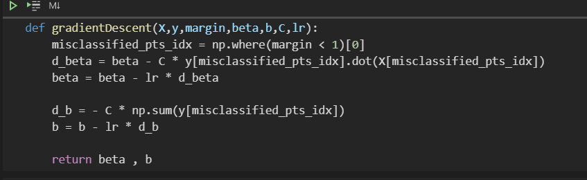

## Fitting Function 
**That return Support vectors where the maximum margin with the best hyperPlane is found**

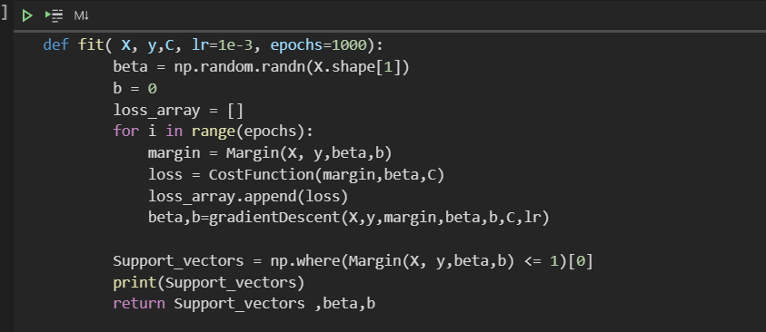

## Predict Function 
**That return only 1 if HyperPlaneequation > 0 or -1  if   HyperPlaneequation <0**

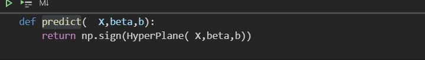

## Score Function 
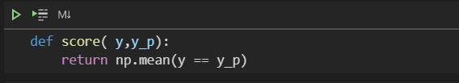

## Load Data Function  
**I used the first 100 Instences from iris data**
**Split Data with 10% for testing data and 90% for training data**

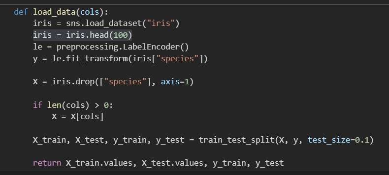

## Result

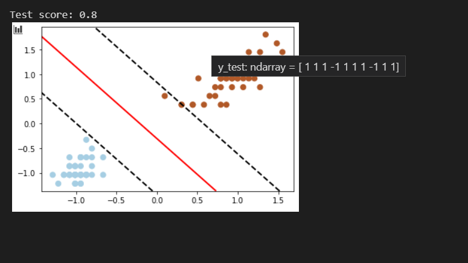

> When I used the first 100 instences from iris data

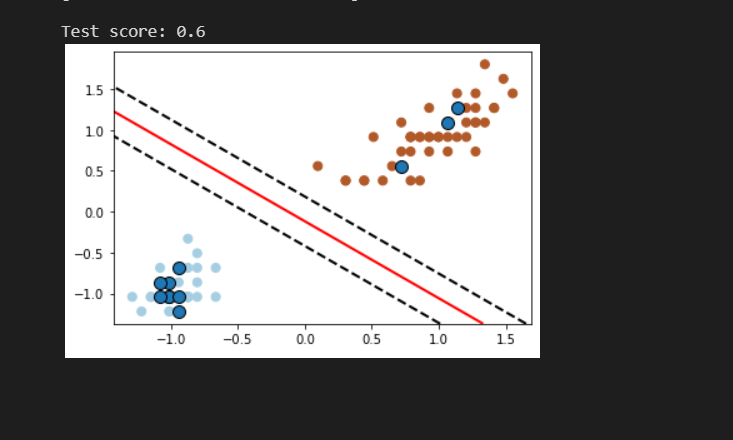

> when i used the last 100 instences from iris data

## All Data
**When I used all data not splitting it to train and test set. because data is very small,just 100 instences and plotting it, it was result**

> When i used the last 100 instences

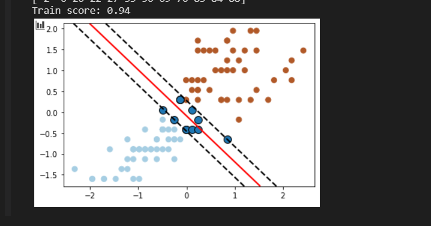

> When i used the first 100 instences

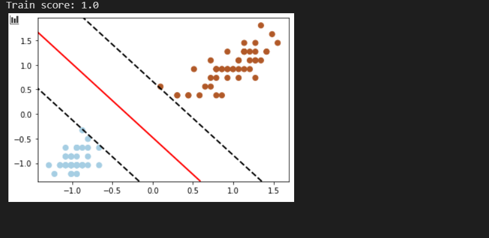

# Conclusion

* **AS We saw in result section, Data with the first 100 instences is more better and without error so it svm with hard margin and we dont need port of slack variable becouse data in this case linearly seperable.** 

* **and with the the last 100 instences data isn't linearly seperable so I used soft margin svm** 

* **I implemented soft margin SVM for this data to be more effective with two part from data (the last and the first 100 instences)**